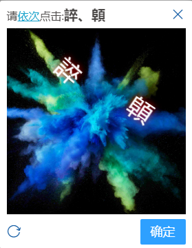
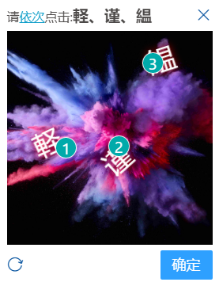

# xjy-captcha-master
纯前端点触验证码

## 预览


## 安装
```
//npm
npm i xjy-captcha-master
//yarn
yarn add xjy-captcha-master
```
## 使用
```javascript
//main.js
import Vue from "vue"
import xjyCaptchaMaster from "xjy-captcha-master"
Vue.component("captcha",xjyCaptchaMaster.captcha)
```
```html
<template>
    <captcha @close="close" @fail=ha"fail" @success="success" :img-list="['https://files.hyz.cool/files/photos/3298760b6d63211941cf6760539beb56.jpg']"/>
</template>

<script>
    export default {
       
        methods: {
            close() {
                console.log("close")
            },
            fail() {
                console.log("fail")
            },
            success() {
                console.log("success")
            }
        }
    }
</script>
```
## 参数解释


 - img-list:
 
   类型：Array

    解释：背景图片Url数组


## 回调函数

 - close:

    解释：关闭回调
    
 - fail:

    解释：验证失败回调
    
 - success:

    解释：验证成功回调
